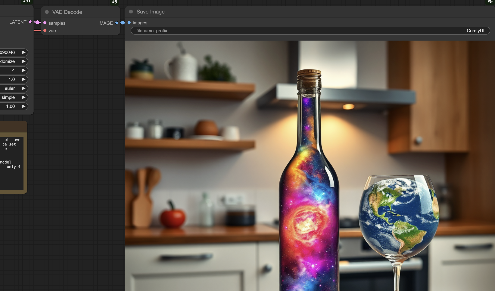

# Instant ComfyUI for MacOS

This script will install ComfyUI and all dependencies on macOS.  I made this for my own use, but you're welcome to use it.



## Usage

Copy and paste this single line into your terminal:

```bash
/bin/zsh -c "$(curl -fsSL https://raw.githubusercontent.com/RamboRogers/mac-comfyui-instant/refs/heads/main/instant-comfyui.sh)"
```

### This script will:

1. Install Homebrew (if not already installed)
2. Install required dependencies:
   - Git
   - Python 3.12
3. Set up ComfyUI:
   - Clone the repository
   - Create and configure virtual environment
   - Install all requirements
4. Create convenient desktop launcher:
   - Generates LaunchComfyUI.app
   - Adds one-click startup capability
5. Launch ComfyUI automatically:
   - Starts the server
   - Opens web interface in default browser


> **Note:** Look for this icon on your desktop. Double-clicking it will automatically launch ComfyUI and open the web interface in your default browser for a seamless experience.


## License and Contact

This project is licensed under the GNU General Public License v3.0 (GPL-3.0) - see the [LICENSE](LICENSE) file for details.

### Connect With Me
- GitHub: [RamboRogers](https://github.com/RamboRogers)
- X/Twitter: [@rogerscissp](https://x.com/rogerscissp)
- Website: [matthewrogers.org](https://matthewrogers.org)
